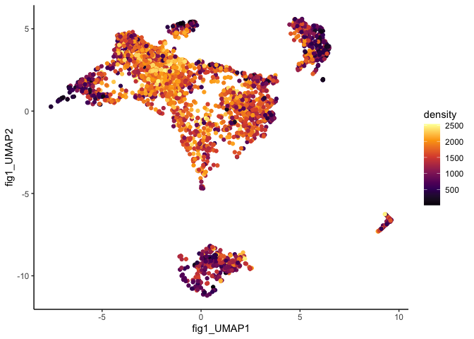
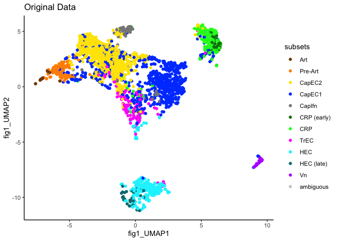
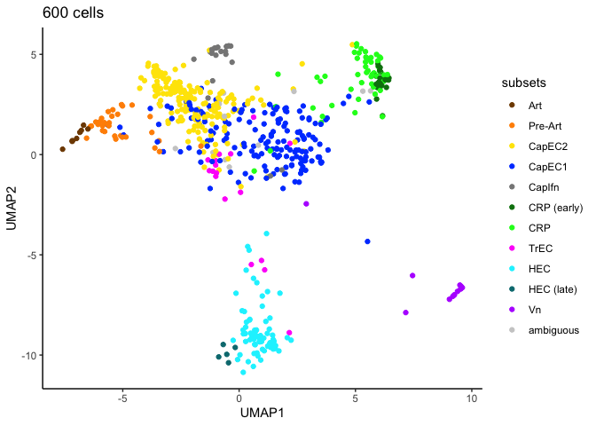

Density-based Reduction of single-cell data
================

## Overview

Dufy is an R package that provides enhanced utility for single cell
analysis. This vignette focuses on methods to reduce the size of large
datasets while preserving cell type diversity in low-density regions and
balancing representation of cell types.

## Installation

``` r
devtools::install_github("kbrulois/Dufy")
```

## Overview of downsamping methods

Dufy provides two novel downsampling approaches: 1) a graphical approach
that selects cells that are closest to a point on a uniform lattice. 2)
a density-based clustering approach that groups cells into clusters such
that cluster sizes are proportional to local density. The latter
approach has two advantages over existing methods that select individual
cells: 1) genes (or other parameters) are aggregated across all cells,
allowing the use of aggregation methods that preserve all detected genes
in the reduced data, including genes detectable in only one or a handful
of cells. 2) there is a one-to-one correspondence between the reduced
data and the original data, allowing seamless switching between the
reduced and original datasets during analysis.

### Density-based clustering approach

``` r
library(Dufy)
library(ggplot2); theme_set(theme_classic())

dummy_data <- readRDS(system.file("/data/dummy_data.rds", package = "Dufy"))
db_kmeans_res <- db_kmeans(data = dummy_data, clusters = 70)
dummy_data_c <- compute_centroids_n(data = dummy_data, 
                                    cluster = db_kmeans_res$cluster, 
                                    centering_function = mean)
```

``` r
plot(dummy_data, col = factor(cut(db_kmeans_res$density, breaks = 6)))
```

<!-- -->

``` r
plot(dummy_data, col = factor(db_kmeans_res$cluster))
points(dummy_data_c, pch = 19, col = factor(unique(db_kmeans_res$cluster)))
text(dummy_data_c, labels = table(db_kmeans_res$cluster)[unique(db_kmeans_res$cluster)])
```

<!-- -->

### Graphical cell selection approach

``` r
gd_res <- graphicalDownsample(data = dummy_data)
```

``` r
plot(gd_res$lattice)
points(dummy_data)
points(dummy_data[gd_res$indices,], pch = 19, col = "red")
```

<!-- -->

### SPADE cell selection approach

``` r
sd_res <- dbSpadeDownsample(dummy_data, d = Dufy::optiDensity(dummy_data))
```

``` r
plot(dummy_data)
points(dummy_data[sd_res$indices,], pch = 19, col = "red")
```

<!-- -->

## Density-based clustering with a single cell dataset

Import mouse blood endothelial cell dataset

``` r
library(SingleCellExperiment)
sc_data <- readRDS(url("http://web.stanford.edu/group/butcherlab/sc_data.rds"))
subset.colors <- setNames(c(sc_data$color.scheme[1:11], "grey80"), 
                          c(sc_data$color.scheme.key[1:11], "ambiguous"))
```

Compute density using an optimized version of SPADE’s density function

``` r
sc_data$density <- optiDensity(reducedDim(sc_data, 'pca'), selection_method = "ks.test")

dat.toplot_og <- as.data.frame(colData(sc_data))

ggplot(dat.toplot_og) + 
  geom_point(aes(x = fig1_UMAP1, y = fig1_UMAP2, color = density)) +
  scale_color_viridis_c(option = "B")
```

<!-- -->

``` r
ggplot(dat.toplot_og) + 
  geom_point(aes(x = fig1_UMAP1, y = fig1_UMAP2, color = subsets)) +
  scale_color_manual(values = subset.colors) +
  ggtitle("Original Data")
```

<!-- -->

Compute density based clusters and cluster centroids.

``` r
db_kmeans_res <- db_kmeans(data = reducedDim(sc_data, 'pca'), 
                           d = sc_data$density, 
                           clusters = 600)

umap_centroids <- compute_centroids_n(data = dat.toplot_og[,c("fig1_UMAP1", "fig1_UMAP2")], 
                                      cluster = db_kmeans_res$cluster, 
                                      centering_function = mean)

approx_subset_labels <- compute_centroids_c(data = colData(sc_data)[,"subsets"],
                                            cluster = db_kmeans_res$cluster, 
                                            ambiguous_cutoff = 0.5)

dat.toplot <- data.frame(UMAP1 = umap_centroids[,1],
                         UMAP2 = umap_centroids[,2],
                         subsets = approx_subset_labels[,1])

ggplot(dat.toplot) + 
  geom_point(aes(x = UMAP1, y = UMAP2, color = subsets)) +
  scale_color_manual(values = subset.colors) +
  ggtitle("600 cells")
```

<!-- -->
